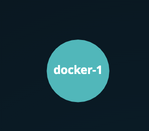

# 42 Cursus
- the project Docker is an initiation of the environment Docker
- it's a solo project
-the project is split in 2 part (00_how_to_docker 01_dockerfiles)

# 42-docker
 Row, row, row your boat... gently down the stream..
 First project on the Docker ecosystem .Learn to think in containers for this subject in which you will handle docker binary and create your first containers with Dockerfiles.
